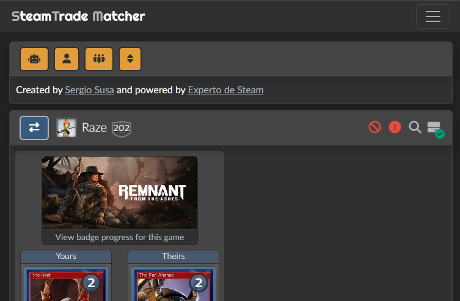
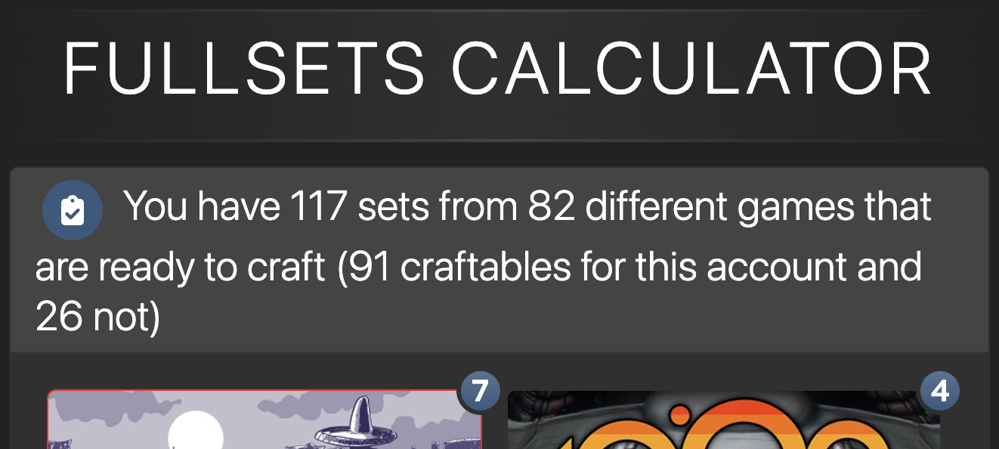
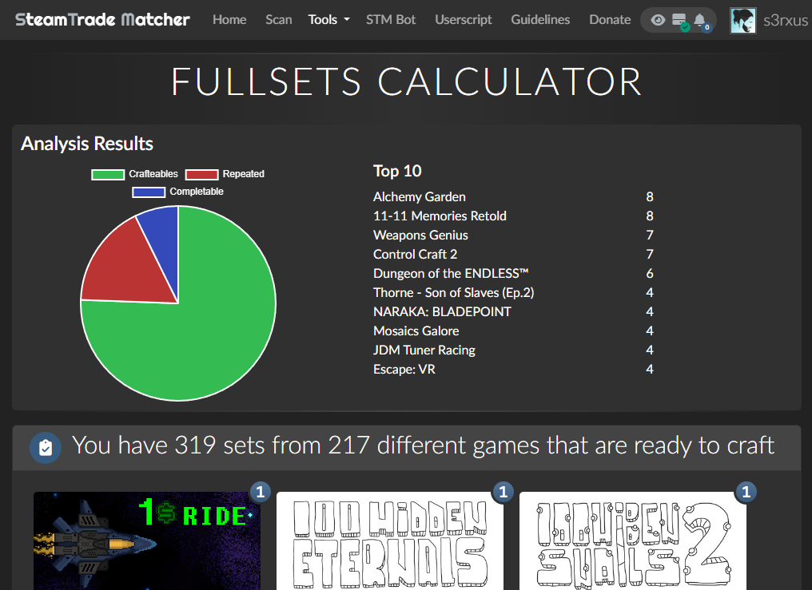

# 🃏Steam Trade Matcher Enhanced🃏

This script enhanced the famous steam trading cards site **Steam Trade Matcher** adding: 

* Add filter actions to exchange results page: 
  * Filter by users type: BOT or non BOT.
  * Sort by trades quantity.
* Add useful links and information to "Full Sets Calculator" tool:
  * [Steam Card Exchange](https://www.steamcardexchange.net/) to game's inventory. 
  * Calculate and mark surplus badges with a border color: RED (only surplus badges) and GREEN (some surplus badges).

### Supported sites

- [Steam Trade Matcher](https://www.steamtradematcher.com)

## 📌Prerequisites📎

- [Tampermonkey (Chrome)](https://tampermonkey.net)
- [Greasemonkey (Firefox)](http://www.greasespot.net)
- [Violent monkey (Opera)](https://addons.opera.com/sk/extensions/details/violent-monkey/)

## 🖥️Installation🖱️

**Github**

- Enter to the user script file (usually named as <code>*.user.js</code>) you want to install.
- Click on the <code>Raw</code> button, the browser extension will recognize this file as a user script.
- Install it.

That's it!

## 🔧Configuration🔧

No extra configuration required.

## 📷Screenshots📷

### ☕Buy me a coffee☕

If you want to support my scripts consider to use:  

- Paypal Me [link](https://paypal.me/sergiosusa?locale.x=es_ES) to send me a tip.

#### Referral links:

- My Letyshops [referral link](https://letyshops.com/es/winwin?ww=17530599) to get 5€ after using the cashback by buying at least 30€ in the first 30 days.
- Steam LVL Up [referral link](https://steamlvlup.com/r/dizwqo) to get 75 gems for free after registration.
- N26 [referral link](https://n26.com/r/sergios6726) to get €10 after spending your first €10 using the N26 card.
- 